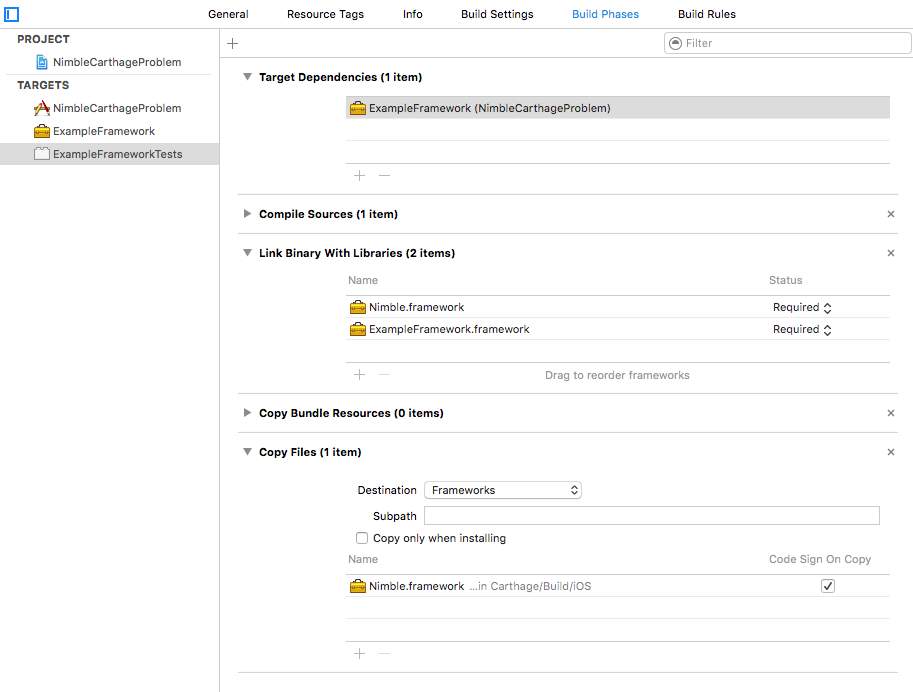

# NimbleCarthageProblem

This repository contains a simple iOS project to demonstrate and document the problem I have encounter when
working with Nimble and Carthage.

The project has one framework with one Swift file containing one Swift class. The framework has associated tests target
generated by Xcode on project creation:

Now I create a framework:

For simplicity, the `Host Application` setting for the `ExampleFrameworkTests` target is set to `None`. We are only
interested in testing the framework, not the app.

Next, I add an example Swift class - `ExampleClass` - to the framework in file `ExampleClass.swift`:

    import Foundation
    
    class ExampleClass {
        func hello() -> String {
            return "hello"
        }
    }

and `ExampleClassTests.swift` to the `ExampleFrameworkTests` target:

    import XCTest
    @testable import ExampleFramework
    
    class ExampleFrameworkTests: XCTestCase {
        
        func testExample() {
            XCTAssertEqual("hello", ExampleClass().hello())
        }
    }

    
I also created a convenience scheme for the `ExampleFrameworkTests` target:

I run the tests and everything pass. All fine.

## Bot with XCTest

Now I create a bot for `ExampleFrameworkTests` scheme - manual trigger, on branch xctest:

The bot runs successfully.

## Bot with Nimble

Now I will add Nimble to the project. We will use Carthage - I assume you have carthage installed, otherwise you can
install it with `brew install carthage`.

I add `Cartfile.private` with the following contents:

    github "Quick/Nimble"

and then I run from the console:

    $ carthage update --platform iOS
    *** Fetching Nimble
    *** Checking out Nimble at "v4.0.0"
    *** xcodebuild output can be found in /var/folders/dy/yw3sj05x4c7csjfz3bxfl5q00000gn/T/carthage-xcodebuild.HogUtZ.log
    *** Building scheme "Nimble-iOS" in Nimble.xcodeproj
    ld: warning: embedded dylibs/frameworks only run on iOS 8 or later
    ld: warning: embedded dylibs/frameworks only run on iOS 8 or later
    ld: warning: embedded dylibs/frameworks only run on iOS 8 or later
    ld: warning: embedded dylibs/frameworks only run on iOS 8 or later

The framework is in `Carthage/Build/iOS`.

I add the Nimble framework to the `ExampleFrameworkTests` target:

Everything as described in the [Quick/Nimble documentation](https://github.com/Quick/Quick/blob/master/Documentation/en-us/InstallingQuick.md#carthage).

All builds and runs well.

Now I create a bot for the nimble branch - with exactly the same settings as the branch for xctest.

