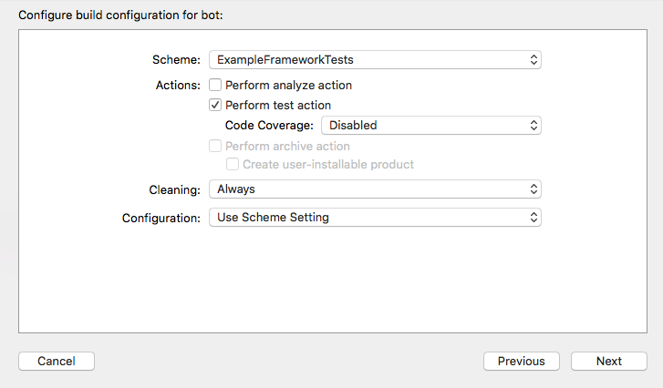

# NimbleCarthageProblem

This repository contains a simple iOS project to demonstrate and document the problem I have encounter when
working with Nimble and Carthage.

The project has one framework with one Swift file containing one Swift class. The framework has associated tests target
generated by Xcode on project creation:

Now I create a framework:

For simplicity, the `Host Application` setting for the `ExampleFrameworkTests` target is set to `None`. We are only
interested in testing the framework, not the app.

Next, I add an example Swift class - `ExampleClass` - to the framework in file `ExampleClass.swift`:

    import Foundation
    
    class ExampleClass {
        func hello() -> String {
            return "hello"
        }
    }

and `ExampleClassTests.swift` to the `ExampleFrameworkTests` target:

    import XCTest
    @testable import ExampleFramework
    
    class ExampleFrameworkTests: XCTestCase {
        
        func testExample() {
            XCTAssertEqual("hello", ExampleClass().hello())
        }
    }

    
I also created a convenience scheme for the `ExampleFrameworkTests` target:

I run the tests and everything pass. All fine.

## Bot with XCTest

Now I create a bot for `ExampleFrameworkTests` scheme - manual trigger, on branch xctest:

The bot runs successfully.

## Bot with Nimble

Now I will add Nimble to the project. We will use Carthage - I assume you have carthage installed, otherwise you can
install it with `brew install carthage`.

I add `Cartfile.private` with the following contents:

    github "Quick/Nimble"

and then I run from the console:

    $ carthage update --platform iOS
    *** Fetching Nimble
    *** Checking out Nimble at "v4.0.0"
    *** xcodebuild output can be found in /var/folders/dy/yw3sj05x4c7csjfz3bxfl5q00000gn/T/carthage-xcodebuild.HogUtZ.log
    *** Building scheme "Nimble-iOS" in Nimble.xcodeproj
    ld: warning: embedded dylibs/frameworks only run on iOS 8 or later
    ld: warning: embedded dylibs/frameworks only run on iOS 8 or later
    ld: warning: embedded dylibs/frameworks only run on iOS 8 or later
    ld: warning: embedded dylibs/frameworks only run on iOS 8 or later

The framework is in `Carthage/Build/iOS`.

I add the Nimble framework to the `ExampleFrameworkTests` target:

Everything as described in the [Quick/Nimble documentation](https://github.com/Quick/Quick/blob/master/Documentation/en-us/InstallingQuick.md#carthage)
and I change my test file so that it has the following content:
 
    import XCTest
    import Nimble
    
    @testable import ExampleFramework
    
    class ExampleFrameworkTests: XCTestCase {
        
        func testExample() {
            expect(ExampleClass().hello()).to(equal("hello"))
        }
    }

All builds and runs well.

Now I create a bot for the nimble branch - with exactly the same settings as the branch for xctest.

This time the bot will fail with a very misleading error:

    Assertion: Opening import file for module 'ExampleFramework': Permission denied
      File: NimbleCarthageProblem/ExampleFrameworkTests/ExampleClassTests.swift:12
      
      
Below is the full log:

    CompileSwiftSources normal x86_64 com.apple.xcode.tools.swift.compiler
        cd /Library/Developer/XcodeServer/Integrations/Caches/7a65d39f35fe6ac5726223e4e40d6924/Source/NimbleCarthageProblem
        export DEVELOPER_DIR=/Applications/Xcode.app/Contents/Developer
        export PATH="/Applications/Xcode.app/Contents/Developer/Platforms/iPhoneSimulator.platform/Developer/usr/bin:
        /Applications/Xcode.app/Contents/Developer/usr/bin:/Applications/Xcode.app/Contents/Developer/usr/bin:/usr/bin:
        /bin:/usr/sbin:/sbin"
        export SDKROOT=/Applications/Xcode.app/Contents/Developer/Platforms/iPhoneSimulator.platform/Developer/SDKs/iPhoneSimulator9.3.sdk
        export TOOLCHAINS=com.apple.dt.toolchain.iOS9_3
        /Applications/Xcode.app/Contents/Developer/Toolchains/XcodeDefault.xctoolchain/usr/bin/swiftc -incremental 
        -module-name ExampleFrameworkTests -Onone -sdk /Applications/Xcode.app/Contents/Developer/Platforms/iPhoneSimulator.platform/Developer/SDKs/iPhoneSimulator9.3.sdk 
        -target x86_64-apple-ios9.3 -g -module-cache-path /Library/Developer/XcodeServer/Integrations/Caches/7a65d39f35fe6ac5726223e4e40d6924/DerivedData/ModuleCache 
        -Xfrontend -serialize-debugging-options -enable-testing 
        -I /Library/Developer/XcodeServer/Integrations/Caches/7a65d39f35fe6ac5726223e4e40d6924/DerivedData/Build/Products/Debug-iphonesimulator 
        -F /Library/Developer/XcodeServer/Integrations/Caches/7a65d39f35fe6ac5726223e4e40d6924/DerivedData/Build/Products/Debug-iphonesimulator 
        -F /Library/Developer/XcodeServer/Integrations/Caches/7a65d39f35fe6ac5726223e4e40d6924/Source/NimbleCarthageProblem/Carthage/Build/iOS 
        -F /Applications/Xcode.app/Contents/Developer/Platforms/iPhoneSimulator.platform/Developer/Library/Frameworks 
        -parse-as-library -c 
        -j9 /Library/Developer/XcodeServer/Integrations/Caches/7a65d39f35fe6ac5726223e4e40d6924/Source/NimbleCarthageProblem/ExampleFrameworkTests/ExampleClassTests.swift 
        -output-file-map /Library/Developer/XcodeServer/Integrations/Caches/7a65d39f35fe6ac5726223e4e40d6924/DerivedData/Build/Intermediates/NimbleCarthageProblem.build/Debug-iphonesimulator/ExampleFrameworkTests.build/Objects-normal/x86_64/ExampleFrameworkTests-OutputFileMap.json 
        -parseable-output -serialize-diagnostics -emit-dependencies -emit-module -emit-module-path 
        /Library/Developer/XcodeServer/Integrations/Caches/7a65d39f35fe6ac5726223e4e40d6924/DerivedData/Build/Intermediates/NimbleCarthageProblem.build/Debug-iphonesimulator/ExampleFrameworkTests.build/Objects-normal/x86_64/ExampleFrameworkTests.swiftmodule 
        -Xcc -I/Library/Developer/XcodeServer/Integrations/Caches/7a65d39f35fe6ac5726223e4e40d6924/DerivedData/Build/Intermediates/NimbleCarthageProblem.build/Debug-iphonesimulator/ExampleFrameworkTests.build/swift-overrides.hmap 
        -Xcc -iquote -Xcc /Library/Developer/XcodeServer/Integrations/Caches/7a65d39f35fe6ac5726223e4e40d6924/DerivedData/Build/Intermediates/NimbleCarthageProblem.build/Debug-iphonesimulator/ExampleFrameworkTests.build/ExampleFrameworkTests-generated-files.hmap 
        -Xcc -I/Library/Developer/XcodeServer/Integrations/Caches/7a65d39f35fe6ac5726223e4e40d6924/DerivedData/Build/Intermediates/NimbleCarthageProblem.build/Debug-iphonesimulator/ExampleFrameworkTests.build/ExampleFrameworkTests-own-target-headers.hmap 
        -Xcc -I/Library/Developer/XcodeServer/Integrations/Caches/7a65d39f35fe6ac5726223e4e40d6924/DerivedData/Build/Intermediates/NimbleCarthageProblem.build/Debug-iphonesimulator/ExampleFrameworkTests.build/ExampleFrameworkTests-all-non-framework-target-headers.hmap 
        -Xcc -ivfsoverlay -Xcc /Library/Developer/XcodeServer/Integrations/Caches/7a65d39f35fe6ac5726223e4e40d6924/DerivedData/Build/Intermediates/NimbleCarthageProblem.build/all-product-headers.yaml -Xcc -iquote 
        -Xcc /Library/Developer/XcodeServer/Integrations/Caches/7a65d39f35fe6ac5726223e4e40d6924/DerivedData/Build/Intermediates/NimbleCarthageProblem.build/Debug-iphonesimulator/ExampleFrameworkTests.build/ExampleFrameworkTests-project-headers.hmap 
        -Xcc -I/Library/Developer/XcodeServer/Integrations/Caches/7a65d39f35fe6ac5726223e4e40d6924/DerivedData/Build/Products/Debug-iphonesimulator/include 
        -Xcc -I/Library/Developer/XcodeServer/Integrations/Caches/7a65d39f35fe6ac5726223e4e40d6924/DerivedData/Build/Intermediates/NimbleCarthageProblem.build/Debug-iphonesimulator/ExampleFrameworkTests.build/DerivedSources/x86_64 
        -Xcc -I/Library/Developer/XcodeServer/Integrations/Caches/7a65d39f35fe6ac5726223e4e40d6924/DerivedData/Build/Intermediates/NimbleCarthageProblem.build/Debug-iphonesimulator/ExampleFrameworkTests.build/DerivedSources 
        -Xcc -DDEBUG=1 -emit-objc-header -emit-objc-header-path /Library/Developer/XcodeServer/Integrations/Caches/7a65d39f35fe6ac5726223e4e40d6924/DerivedData/Build/Intermediates/NimbleCarthageProblem.build/Debug-iphonesimulator/ExampleFrameworkTests.build/Objects-normal/x86_64/ExampleFrameworkTests-Swift.h 
        -Xcc -working-directory/Library/Developer/XcodeServer/Integrations/Caches/7a65d39f35fe6ac5726223e4e40d6924/Source/NimbleCarthageProblem -Xfrontend -serialize-debugging-options

and also this:

    CompileSwift normal x86_64 /Library/Developer/XcodeServer/Integrations/Caches/7a65d39f35fe6ac5726223e4e40d6924/Source/NimbleCarthageProblem/ExampleFrameworkTests/ExampleClassTests.swift
        cd /Library/Developer/XcodeServer/Integrations/Caches/7a65d39f35fe6ac5726223e4e40d6924/Source/NimbleCarthageProblem
        /Applications/Xcode.app/Contents/Developer/Toolchains/XcodeDefault.xctoolchain/usr/bin/swift -frontend -c -primary-file 
        /Library/Developer/XcodeServer/Integrations/Caches/7a65d39f35fe6ac5726223e4e40d6924/Source/NimbleCarthageProblem/ExampleFrameworkTests/ExampleClassTests.swift 
        -target x86_64-apple-ios9.3 -enable-objc-interop -sdk /Applications/Xcode.app/Contents/Developer/Platforms/iPhoneSimulator.platform/Developer/SDKs/iPhoneSimulator9.3.sdk 
        -I /Library/Developer/XcodeServer/Integrations/Caches/7a65d39f35fe6ac5726223e4e40d6924/DerivedData/Build/Products/Debug-iphonesimulator 
        -F /Library/Developer/XcodeServer/Integrations/Caches/7a65d39f35fe6ac5726223e4e40d6924/DerivedData/Build/Products/Debug-iphonesimulator 
        -F /Library/Developer/XcodeServer/Integrations/Caches/7a65d39f35fe6ac5726223e4e40d6924/Source/NimbleCarthageProblem/Carthage/Build/iOS 
        -F /Applications/Xcode.app/Contents/Developer/Platforms/iPhoneSimulator.platform/Developer/Library/Frameworks 
        -enable-testing -g -module-cache-path /Library/Developer/XcodeServer/Integrations/Caches/7a65d39f35fe6ac5726223e4e40d6924/DerivedData/ModuleCache 
        -serialize-debugging-options -serialize-debugging-options -Xcc 
        -I/Library/Developer/XcodeServer/Integrations/Caches/7a65d39f35fe6ac5726223e4e40d6924/DerivedData/Build/Intermediates/NimbleCarthageProblem.build/Debug-iphonesimulator/ExampleFrameworkTests.build/swift-overrides.hmap 
        -Xcc -iquote -Xcc /Library/Developer/XcodeServer/Integrations/Caches/7a65d39f35fe6ac5726223e4e40d6924/DerivedData/Build/Intermediates/NimbleCarthageProblem.build/Debug-iphonesimulator/ExampleFrameworkTests.build/ExampleFrameworkTests-generated-files.hmap 
        -Xcc -I/Library/Developer/XcodeServer/Integrations/Caches/7a65d39f35fe6ac5726223e4e40d6924/DerivedData/Build/Intermediates/NimbleCarthageProblem.build/Debug-iphonesimulator/ExampleFrameworkTests.build/ExampleFrameworkTests-own-target-headers.hmap 
        -Xcc -I/Library/Developer/XcodeServer/Integrations/Caches/7a65d39f35fe6ac5726223e4e40d6924/DerivedData/Build/Intermediates/NimbleCarthageProblem.build/Debug-iphonesimulator/ExampleFrameworkTests.build/ExampleFrameworkTests-all-non-framework-target-headers.hmap 
        -Xcc -ivfsoverlay -Xcc /Library/Developer/XcodeServer/Integrations/Caches/7a65d39f35fe6ac5726223e4e40d6924/DerivedData/Build/Intermediates/NimbleCarthageProblem.build/all-product-headers.yaml -Xcc -iquote -Xcc /Library/Developer/XcodeServer/Integrations/Caches/7a65d39f35fe6ac5726223e4e40d6924/DerivedData/Build/Intermediates/NimbleCarthageProblem.build/Debug-iphonesimulator/ExampleFrameworkTests.build/ExampleFrameworkTests-project-headers.hmap 
        -Xcc -I/Library/Developer/XcodeServer/Integrations/Caches/7a65d39f35fe6ac5726223e4e40d6924/DerivedData/Build/Products/Debug-iphonesimulator/include -Xcc -I/Library/Developer/XcodeServer/Integrations/Caches/7a65d39f35fe6ac5726223e4e40d6924/DerivedData/Build/Intermediates/NimbleCarthageProblem.build/Debug-iphonesimulator/ExampleFrameworkTests.build/DerivedSources/x86_64 
        -Xcc -I/Library/Developer/XcodeServer/Integrations/Caches/7a65d39f35fe6ac5726223e4e40d6924/DerivedData/Build/Intermediates/NimbleCarthageProblem.build/Debug-iphonesimulator/ExampleFrameworkTests.build/DerivedSources -Xcc -DDEBUG=1 
        -Xcc -working-directory/Library/Developer/XcodeServer/Integrations/Caches/7a65d39f35fe6ac5726223e4e40d6924/Source/NimbleCarthageProblem 
        -emit-module-doc-path /Library/Developer/XcodeServer/Integrations/Caches/7a65d39f35fe6ac5726223e4e40d6924/DerivedData/Build/Intermediates/NimbleCarthageProblem.build/Debug-iphonesimulator/ExampleFrameworkTests.build/Objects-normal/x86_64/ExampleClassTests~partial.swiftdoc 
        -Onone -parse-as-library -module-name ExampleFrameworkTests -emit-module-path /Library/Developer/XcodeServer/Integrations/Caches/7a65d39f35fe6ac5726223e4e40d6924/DerivedData/Build/Intermediates/NimbleCarthageProblem.build/Debug-iphonesimulator/ExampleFrameworkTests.build/Objects-normal/x86_64/ExampleClassTests~partial.swiftmodule 
        -serialize-diagnostics-path /Library/Developer/XcodeServer/Integrations/Caches/7a65d39f35fe6ac5726223e4e40d6924/DerivedData/Build/Intermediates/NimbleCarthageProblem.build/Debug-iphonesimulator/ExampleFrameworkTests.build/Objects-normal/x86_64/ExampleClassTests.dia 
        -emit-dependencies-path /Library/Developer/XcodeServer/Integrations/Caches/7a65d39f35fe6ac5726223e4e40d6924/DerivedData/Build/Intermediates/NimbleCarthageProblem.build/Debug-iphonesimulator/ExampleFrameworkTests.build/Objects-normal/x86_64/ExampleClassTests.d 
        -emit-reference-dependencies-path /Library/Developer/XcodeServer/Integrations/Caches/7a65d39f35fe6ac5726223e4e40d6924/DerivedData/Build/Intermediates/NimbleCarthageProblem.build/Debug-iphonesimulator/ExampleFrameworkTests.build/Objects-normal/x86_64/ExampleClassTests.swiftdeps 
        -o /Library/Developer/XcodeServer/Integrations/Caches/7a65d39f35fe6ac5726223e4e40d6924/DerivedData/Build/Intermediates/NimbleCarthageProblem.build/Debug-iphonesimulator/ExampleFrameworkTests.build/Objects-normal/x86_64/ExampleClassTests.o
    
    /Library/Developer/XcodeServer/Integrations/Caches/7a65d39f35fe6ac5726223e4e40d6924/Source/NimbleCarthageProblem/ExampleFrameworkTests/ExampleClassTests.swift:12:18: error: opening import file for module 'ExampleFramework': Permission denied
    @testable import ExampleFramework

**This error occurs only on build server. Local compilation is all good. This error is first after upgrading to new
Server (Version 5.1 (15S5127)) and Xcode (Version 7.3 (7D175))**.

A temporary solution to this problem is to add a *Before Integration Trigger*:

    cd NimbleCarthageProblem && /usr/local/bin/carthage build --platform iOS

also shown below:

> I was using the trigger in the first place originally, but after Nimble was failing a couple of times, I decided to
include Nimble framework in the repository.

I am wondering if anyone experienced this and maybe found some solution.

## Example project

The example project can be found at [github project url](https://github.com/mczenko/NimbleCarthageProblem). 
On branch `xctest` we see the version without Nimble. On branch `nimble` we have version with Nimble fraemwork added.
